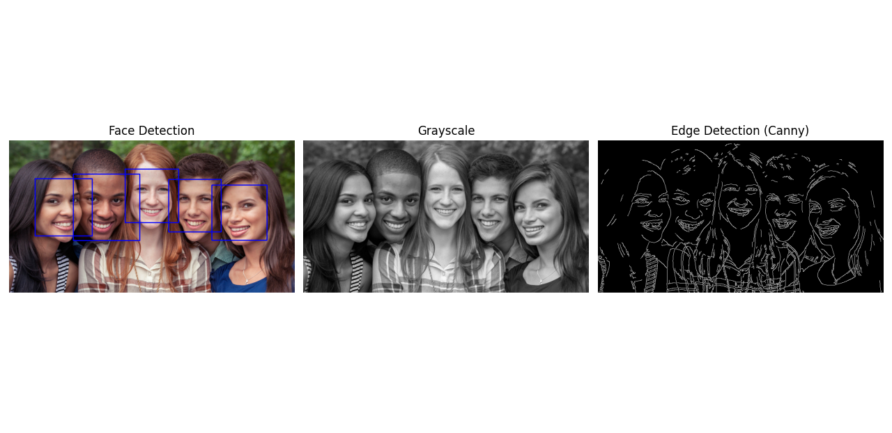

# Advanced Machine Learning & AI Module

This comprehensive module covers key areas of modern AI/ML with practical Python implementations.

## Features

- **Deep Learning**
  - TensorFlow: MNIST classifier with Keras
  - PyTorch: Custom neural network implementation

- **Natural Language Processing**
  - Text preprocessing (tokenization, stemming)
  - Sentiment analysis with Naive Bayes

- **Reinforcement Learning**
  - Q-learning for CartPole environment
  - Training visualization

- **Computer Vision**
  - Image processing with OpenCV
  - Face detection using Haar cascades

  Original image
  
[alt text](groupofpeople.png)

After Detection😎:

 !

